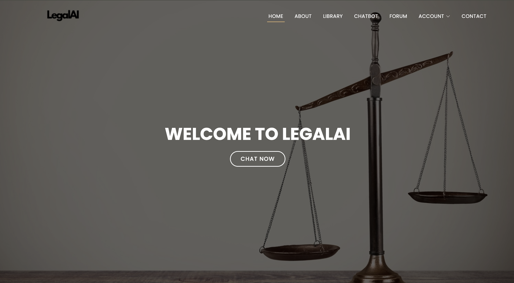
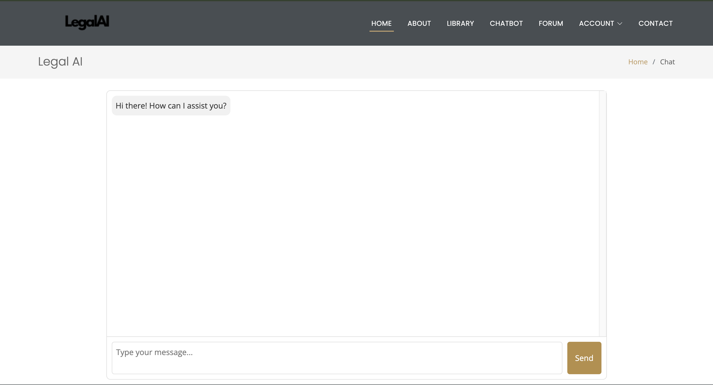
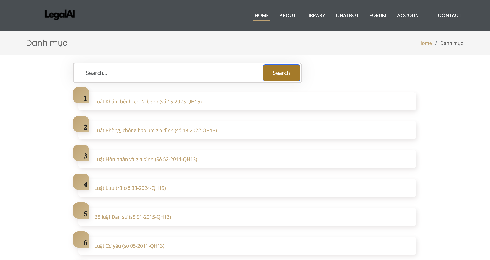
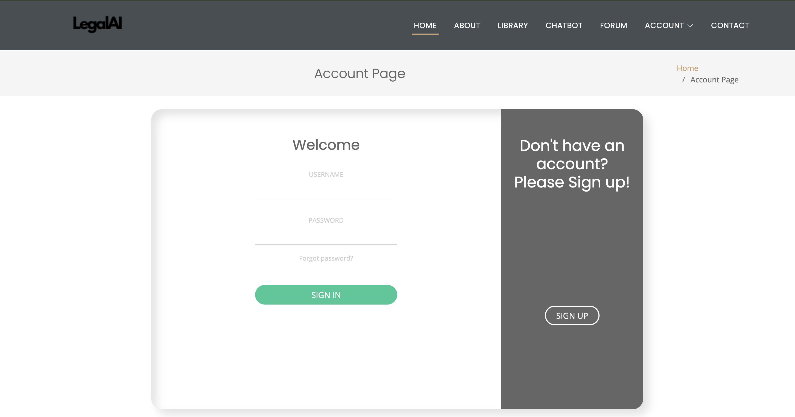

# LegalAI
LegalAI is an advanced AI-powered platform designed to assist users in navigating Vietnam’s legal landscape. By leveraging state-of-the-art Large Language Models (LLMs) and Retrieval-Augmented Generation (RAG) techniques, LegalAI provides accurate and context-aware legal assistance. The platform integrates an intelligent chatbot, a legal document library, and an interactive discussion forum, making legal knowledge more accessible to the public.

### Key Features
🧠 AI-Powered Legal Chatbot: Uses fine-tuned LLMs and RAG for accurate legal assistance.
📚 Legal Document Library: Fast keyword-based and semantic search with MongoDB storage.
💬 Discussion Forum: Connects users and legal experts with threaded discussions and role-based access.
🔐 Secure User Authentication: Implements OAuth2, JWT, and data encryption for privacy protection.

### Home Page


### Legal Chatbot


### Legal Library


### Login / Registration


## 🛠️ Installation and Running the Project
### System Requirements
- Python 3.x
- Django
- MongoDB

### Installation
1. Clone the repository:
   ```bash
   git clone https://github.com/phulocnguyen/LegalAI.git
   cd LegalAI
2. Create and activate a virtual environment:
    ```bash
    python -m venv venv
    source venv/bin/activate  # On macOS/Linux
    venv\Scripts\activate  # On Windows

3. Install dependencies
      ```bash
      pip install -r requirements.txt

4. Run the project:
    ```bash
    python manage.py runserver


